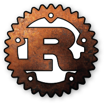

  

# Rust - Training

From wikipedia

Rust is a systems programming language[11] with a focus on **safety**, **especially safe concurrency**,[12][13] supporting **functional** and **imperative-procedural paradigms**. Rust is syntactically similar to C++[according to whom?], but its designers intend it to provide **better memory safety** while still **maintaining performance**.

### Prerequisites

Following are the minimum tested versions for the tools and libraries you need for running this repo:

- Rust: 1.32.0 (9fda7c223 2019-01-16) or newer

- Cargo: 1.32.0 (8610973aa 2019-01-02) or newer

## Practices

### Table of Contents

- Basic
  - [**Installing rust**](practices/1-installing-rust.md)
  - [**Hello app**](practices/2-hello-app/README.md)
  - [**Unit test with Rust**](practices/3-unit-test-with-rust/README.md)
  - [**Basic types**](practices/4-basic-types/README.md)
